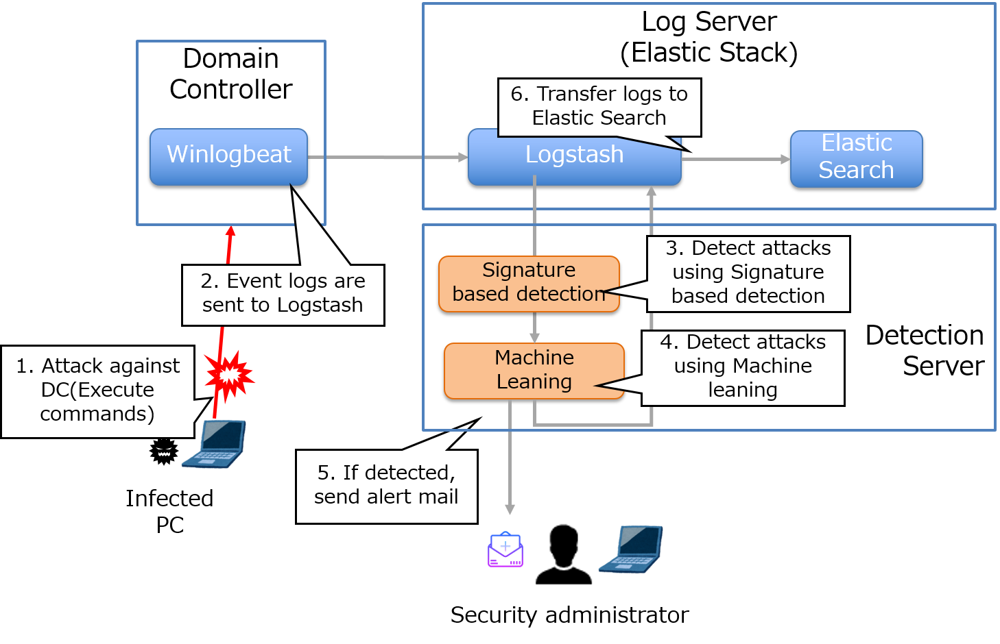

# Real-time detection tool of attacks leveraging Domain Administrator privilege

This is a real-time detection tool for detecting attack against Active Directory leveraging Domain Administrator privileges using Domain Controller Event logs.
Our tool can useful for immediate incident response for targeted attacks.

Our tool consists of the following steps to reduce false detection rate and support immediate incident response.
* Step1 (Signature based detection): Analyze  logs using several signatures focusing on the characteristics of the attack activities.
* Step2 (Machine Learning): Analyze logs with unsupervised machine learning in order to detect unusual command execution. 
* Step3 (Real-time alert): Raise real-time alerts using Elastic Stack if attack activities are detected.

<a href="Arsenal_eu-18-Real-time-Detection-of-Attacks-Leveraging-Domain-Administrator-Privilege.pdf" target="_blank">Documentation of the tool is here</a>

## Tool detail
###	Function of the tool
Our tool consists of the following components:
* Detection Server: Detects attack activities leveraging Domain Administrator privileges using signature based detection and Machine Learning. A Web API for detection is provided.
* Log Server: Collects the Domain Controller’s Event logs in real-time and creates log visualizations.

1. Event logs of the Domain Controller are sent to the Detection Server in real-time.
2. The Detection Server analyzes the logs using signature-based algorithms and machine leaning in order to distinguish malicious attack activities from event logs.
3. Send an alert email to the security administrator and add a flag that indicates an attack to the log if an attack is detected.
4. Logs are sent to the Log Server.
5. The Log Server visualizes the logs and the detection result.

###	Input of the tools: Event logs of the Domain Controller. 
4672: An account assigned with special privileges logged on.
4674: An operation was attempted on a privileged object
4688: A new process was created
4768: A Kerberos authentication ticket (TGT) was requested
4769: A Kerberos service ticket was requested

###	Output of the tool
Distinguish logs that include malicious attack activities from logs that record normal and legitimate operations, and identity infected computers and accounts. If attacks are detected, send email alerts to security administrators.

###	System Requirements
* Domain Controller
    * Winlogbeat (Open-source log analysis platform)
* Elactic Stack (Open-source + custom programs)
    * Logstash: Parse logs, launch the detection program and transfer logs to Elastic Search
    * Elastic Search: Collects logs and provides API interface for log detection
    * Kibana: Visualizes the detection results
* Detection Server: Runs detection programs(custom programs) 
